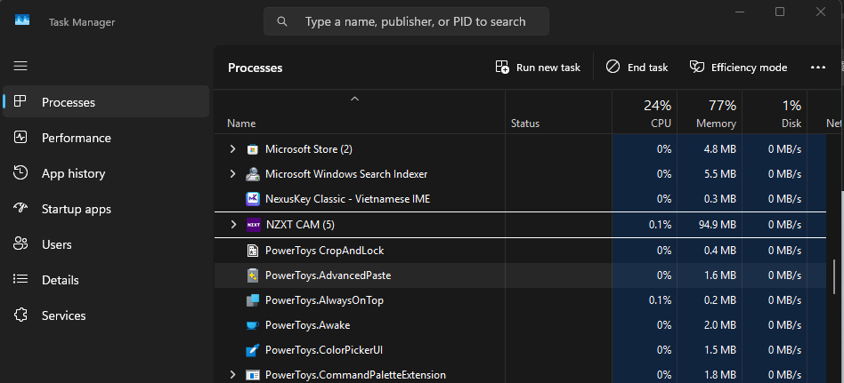

## Build từ mã nguồn

### Yêu cầu

- **Windows 10/11**
- **Visual Studio 2022** (workload "Desktop development with C++" + ATL)
- **CMake 3.20+**

Các thư viện phụ thuộc (Sciter SDK, Google Test, toml++) đã có sẵn trong `extern/`.

### Build

```powershell
cmake -B build -G "Visual Studio 17 2022" -A x64
cmake --build build --config Release --target NextKeyApp
```

### Chạy test

```powershell
cmake --build build --config Release --target NextKeyTests
ctest --test-dir build --build-config Release --output-on-failure
```

---

## Kiến trúc

NexusKey gồm ba lớp:

| Lớp | Target | Mô tả |
|-----|--------|-------|
| **NextKeyEngine** | Static lib | Engine gõ tiếng Việt thuần C++20 (Telex, VNI), kiểm tra chính tả, chuyển bảng mã. Không phụ thuộc platform. |
| **NextKeyCore** | Static lib | Lớp platform — shared memory IPC, quản lý config, smart switch. |
| **NextKeyApp** | Win32 EXE | Ứng dụng GUI với Sciter.JS, hook engine, tray icon, tự cập nhật. |
| **NextKeyTSF** | DLL | Tích hợp Text Services Framework — đăng ký như Windows input method. |

### Tối ưu bộ nhớ

NexusKey được thiết kế với kiến trúc gọn nhẹ, không phụ thuộc runtime nặng, nên bản thân chương trình đã rất tiết kiệm tài nguyên — khởi chạy chỉ chiếm khoảng **1.6 ~ 2 MB RAM**. Nhờ footprint nhỏ, hệ điều hành có thể dễ dàng trim working set xuống còn khoảng **0.3 MB** sau một thời gian idle:

<p align="center">
  
</p>
<p align="center"><em>NexusKey chỉ chiếm 0.3 MB RAM — kiến trúc nhẹ, OS dễ dàng tối ưu</em></p>

---

## English Version

<details>
<summary>Click to expand English version</summary>


### Privacy Policy
* **No Keylogging:** NexusKey does not collect, store, or transmit your keystrokes.
* **No Data Collection:** No personal data is sent to any server.
* **Offline First:** The software operates entirely locally on your machine.
* **Open Source:** You can verify this behavior by reviewing our source code.

### Features

**Input Methods & Code Tables**
- **Input methods:** Telex, VNI, Simple Telex
- **Code tables:** Unicode, TCVN3, VNI Windows, Unicode Compound, Vietnamese Locale
- **Tone placement:** Modern (oà, uý) and classic (òa, úy) options

**Spell Check & English Detection**
- **Spell checker** — Vietnamese word validation, reduces accidental tone placement on English words
- **Free typing mode** — Bypass English detection, allows free tone placement (e.g., `yes` → `ýe`)
- **Quick-disable shortcuts** — Solo Ctrl temporarily disables spell check; Double-Alt temporarily disables Vietnamese for current word

**Smart Switching**
- **Smart Switch** — Automatically remembers V/E mode per application
- **Exclude Apps (Hard)** — Force English and block toggle completely for specified apps
- **Exclude Apps (Soft)** — Always reset to English when opening/switching to an app, but still allows toggling to Vietnamese via hotkey — ideal for fullscreen games
- **Auto-disable on CJK** — Disables Vietnamese input when keyboard layout is CJK (Chinese, Japanese, Korean)
- **Per-app configuration** — Code table and input method overrides per application
- **Import/Export** — Import and export excluded apps lists from file

**Macros & Quick Typing**
- **Macros** — Text expansion shortcuts (e.g., `addr` → full address), supports newlines
- **Macros in English mode** — Allows macro expansion while in English mode
- **Quick consonants** — cc→ch, gg→gi, nn→ng, plus quick start/end consonant shortcuts
- **Auto-capitalize** — Automatically capitalizes first letter after sentence-ending punctuation, including macro output

**Convert Tool**
- **Quick convert via selection** — Select text and press hotkey to convert instantly
- **Sequential conversion** — Automatically cycles through conversion options (UPPERCASE, lowercase, Title Case, Remove accents...) then returns to original. Only active when "Auto paste + select" is enabled
- **Multi-encoding support** — Convert between Unicode, TCVN3, VNI Windows

**User Interface**
- **Glassmorphism UI** — Transparent, backdrop blur, rounded corners in Windows 11 style
- **Auto Theme Sync** — Automatically switches Light/Dark in real-time with Windows, no restart needed
- **Icon Color** — Customizable V/E icon colors on the system tray
- **Bilingual** — UI supports both Vietnamese and English

**System**
- **TSF Engine** — Text Services Framework integration for modern applications, with per-app TSF selection
- **Auto-update** — Built-in update checker and installer
- **[Security hardened](docs/SECURITY.md)** — Code optimized to minimize security vulnerabilities
- **High performance** — Optimized system processing

### Building

**Prerequisites:** Windows 10/11, Visual Studio 2022 (Desktop C++ + ATL), CMake 3.20+

```powershell
cmake -B build -G "Visual Studio 17 2022" -A x64
cmake --build build --config Release --target NextKeyApp
```

### Architecture

| Layer | Target | Description |
|-------|--------|-------------|
| **NextKeyEngine** | Static lib | Pure C++20 Vietnamese input engines (Telex, VNI), spell checker, code table converter. Zero platform dependencies. |
| **NextKeyCore** | Static lib | Platform layer — shared memory IPC, configuration management, smart switch. |
| **NextKeyApp** | Win32 EXE | GUI application with Sciter.JS UI, hook engine, tray icon, auto-update. |
| **NextKeyTSF** | DLL | Text Services Framework integration — registers as a Windows input method. |

#### Memory Optimization

NexusKey is built with a lean architecture and no heavy runtime dependencies, keeping resource usage minimal — starting at only **~1.6–2 MB RAM**. Thanks to its small footprint, the OS can easily trim the working set down to as low as **0.3 MB** after idle:

<p align="center">
  
</p>
<p align="center"><em>NexusKey at 0.3 MB RAM — lightweight architecture, easily optimized by the OS</em></p>

</details>

---

## Credits


Dự án sử dụng **dual license**:

| Thành phần | License |
|------------|---------|
| **Engine** (`src/core/engine/*`) | [GPL-3.0](LICENSE) **hoặc** [Commercial](LICENSE-COMMERCIAL) |
| **Tất cả phần còn lại** | [GPL-3.0](LICENSE) |

- **Sử dụng open-source (GPL-3.0):** Bạn có thể sử dụng, sửa đổi, phân phối lại toàn bộ mã nguồn với điều kiện giữ nguyên license GPL-3.0 cho derivative works.
- **Sử dụng thương mại/closed-source:** Nếu muốn dùng engine NexusKey trong sản phẩm proprietary, vui lòng liên hệ tác giả để lấy commercial license. Xem [LICENSE-COMMERCIAL](LICENSE-COMMERCIAL).
